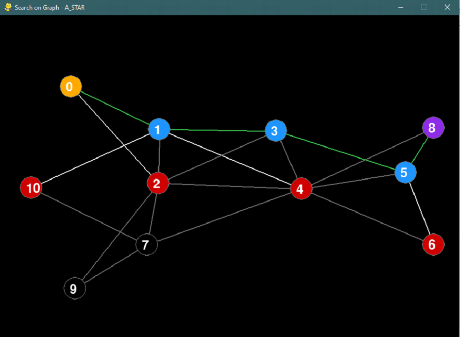

# AI Searching Algorithm

AI Searching Algorithm is a project implemented in Python using the pygame library. It includes implementations for simulating various searching algorithms such as Breadth-First Search (BFS), Depth-First Search (DFS), Uniform Cost Search (UCS), and A*.

## Demo

## Installation

To use AI Searching Algorithm, follow these steps:

1. Clone this repository to your local machine: git clone <repository_url>
2. Install the required dependencies using pip: pip install -r requirements.txt

## Usage

To run the program, execute the following command in the terminal: python main.py input_file search_algorithm

Replace `input_file` with the path to your input file and `search_algorithm` with one of the following algorithms: `bfs`, `dfs`, `ucs`, `a_star`, etc.

For example: python main.py input.txt bfs

## Features

- Implementations for various searching algorithms
- Simulations using the pygame library

## Contributing

Contributions are welcome! If you have any ideas for improvements or new features, feel free to open an issue or submit a pull request.

## Acknowledgements

- Inspired by concepts in AI searching algorithms and graphs
- Implemented in Python with the pygame library
